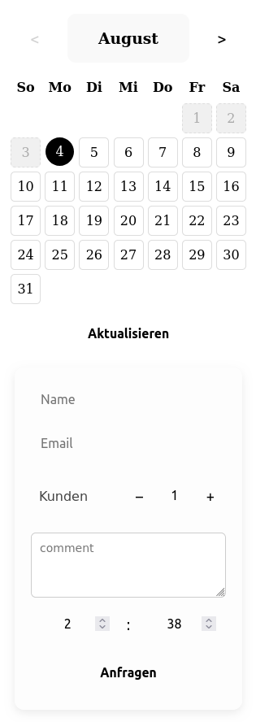
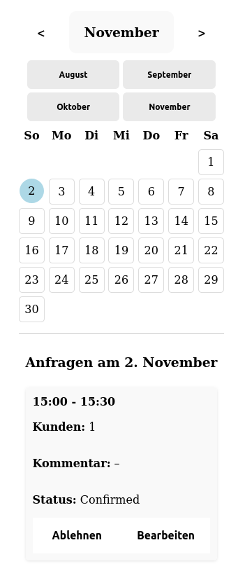
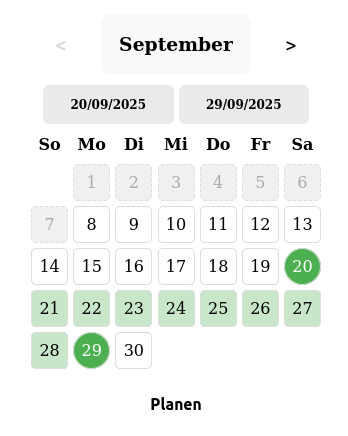

# BarberFrontend

A minimal Angular frontend for a barber shop booking system.

## Features

-  Date picker with monthly navigation
-  Book 35-minute, non-overlapping appointments
-  Barber login to accept/reject requests
-  View daily scheduled appointments
-  Plan holidays

